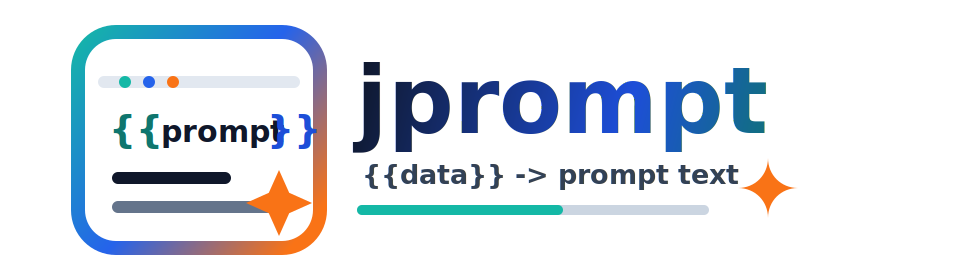

<p align="center">
  
</p>

<h1 align="center">jprompt</h1>

<p align="center">
  A lightweight Java prompt template library for AI Agents and LLM applications.
</p>

<p align="center">
  <a href="README.md">中文</a> · <a href="docs/usage.md">Usage Guide</a>
</p>

<p align="center">
  <a href="https://search.maven.org/artifact/cn.welsione/jprompt"></a>
  <a href="LICENSE"></a>
  <a href="https://adoptium.net/"></a>
</p>

## What Is jprompt

jprompt keeps prompt files readable while giving Java projects a small, typed entry point for loading, rendering, and managing LLM prompts. It is built for teams that treat prompts as engineering assets: committed to the repository, reviewed with code, and evolved alongside the application.

## Highlights

- One API for static prompts and dynamic templates: `JPrompt<T>`
- Markdown-friendly placeholders with `{{name}}`
- Variables, defaults, conditions, loops, equality checks, functions, and simple expressions
- Classpath, file system, composite, and custom template loaders
- Cache controls with TTL and explicit cache eviction
- Configurable missing-variable policies for LLM-friendly output
- Java 17+, with a deliberately small dependency surface

## Install

```xml
<dependency>
    <groupId>cn.welsione</groupId>
    <artifactId>jprompt</artifactId>
    <version>1.0.0</version>
</dependency>
```

## 30-Second Start

Create a prompt file:

```markdown
User: {{name}}
Status: {{#if active}}online{{#else}}offline{{/if}}
```

Render it from Java:

```java
JPrompt<UserData> prompt = JPrompt.template("prompts/user.md", UserData.class);
String text = prompt.build(userData);
```

Static prompts use the same entry:

```java
String systemPrompt = JPrompt.get("prompts/system.md").get();
```

## Documentation

- [Usage Guide](docs/usage.md): installation, template syntax, loaders, caching, global configuration, and API examples

## License

MIT License.
